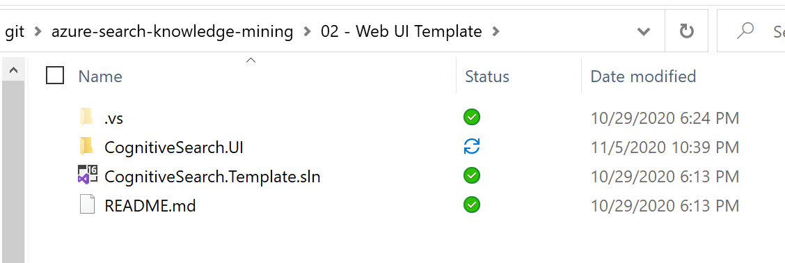

# Cognitive Search UI Template
This folder contains a basic web front end that can be used to quickly create a view of your search results.  With just a few simple steps, you can configure this template UI to query your newly created search index.

The Cognitive Search Template contains two projects:

1. **CognitiveSearch.UI** - this is a .NET Core MVC Web app used as a Template UI for querying a search index. This is the focus of this README.
2. **CognitiveSearch.Skills** - this is an Azure Function project used for creating C# custom skills. For more information on custom skills, please see the the documentation in *03 - Data Science & Custom Skills*.

In just a few steps, you can configure this template UI to query your search index. This template will render a web page similar to the following:


## Prerequisites

1. Visual Studio 2019 or newer - [Download](https://visualstudio.microsoft.com/downloads/)

## 1. Open the Solution

Open the Visual Studio Solution file (CognitiveSearch.Template.sln) from Visual Studio 2019



Open the Solution Explorer in the Visual Studio


## 1. Update appsettings.json

To configure your web app to connect to your Azure services, simply update the *appsettings.json* file.

This file contains a mix of required and optional fields described below.

### Required fields

```json
  // Required fields
  "SearchServiceName": "",
  "SearchApiKey": "",
  "SearchIndexName": "",
  "SearchIndexerName": "",
  "StorageAccountName": "",
  "StorageAccountKey": "",
  "StorageContainerAddress": "https://{storage-account-name}.blob.core.windows.net/{container-name}",
  "KeyField": "metadata_storage_path",
  "IsPathBase64Encoded": true,
```

1. **SearchServiceName** - Azure Search service name
2. **SearchApiKey** - Azure Search service API key
3. **SearchIndexName** - Azure Search index name
4. **SearchIndexerName** - Azure Search indexer name
5. **StorageAccountName** - Azure Blob Storage Account
6. **StorageAccountKey** - Azure Storage Account name
7. **StorageContainerAddress** - The URL to the storage container where your documents are stored. This should be in the following format: *https://*storageaccountname*.blob.core.windows.net/*containername**
8. **KeyField** - They key field for your search index. This should be set to the field specified as a key document Id in the index. By default this is *metadata_storage_path*.
9. **IsPathBase64Encoded** - By default, metadata_storage_path is the key, and it gets base64 encoded so this is set to true by default. If your key is not encoded, set this to false.

### Optional Fields

While some fields are optional, we recommend not removing them from *appsettings.json* to avoid any possible errors.

```json
  // Optional instrumentation key
  "InstrumentationKey": "",

  // Optional container addresses if using more than one indexer:
  "StorageContainerAddress2": "https://{storage-account-name}.blob.core.windows.net/{container-name}",
  "StorageContainerAddress3": "https://{storage-account-name}.blob.core.windows.net/{container-name}",

  // Optional key to an Azure Maps account if you would like to display the geoLocation field in a map
  "AzureMapsSubscriptionKey": "",

  // Set to the name of a facetable field you would like to represent as a graph.
  // You may also set to a comma separated list of the facet names if you would like more than one facet type on the graph.
  "GraphFacet": "keyPhrases, locations",

  // Additional Customizations
  "Customizable": "true",
  "OrganizationName": "Microsoft",
  "OrganizationLogo": "~/images/logo.png",
  "OrganizationWebSiteUrl": "https://www.microsoft.com"

```

1. **InstrumentationKey** - Optional instumentation key for Application Insights. The instrumentation key connects the web app to Application Inisghts in order to populate the Power BI reports.
2. **StorageContainerAddress2** & **StorageContainerAddress3** - Optional container addresses if using more than one indexer
3. **AzureMapsSubscriptionKey** - You have the option to provide an Azure Maps account if you would like to display a geographic point in a map in the document details. The code expects a field called *geolocation* of type Edm.GeographyPoint. If your wish to change this behavior (for instance if you would like to use a different field), you can modify details.js.

4. **GraphFacet** - The GraphFacet is used for generating the relationship graph. This can now be edited in the UI.
5. **Customizable** - Determines if user is allowed to *customize* the web app. Customizations include uploading documents and changing the colors/logo of the web app. **OrganizationName**,  **OrganizationLogo**, and **OrganizationWebSiteUrl** are additional fields that also allow you to do light customization.

## 2. Update SearchModel.cs

At this point, your web app is configured and is ready to run. By default, all facets, tags, and fields will be used in the UI.

If you would like to further customize the UI, you can update the following fields in *Search\SearchModel.cs*. You can select the filters that you are able to facet on, the tags shown with the results, as well as the fields returned by the search.


**Facets** - Defines which facetable fields will show up as selectable filters in the UI. By default all facetable fields are included.

**Tags** - Defines which fields will be added to the results card and details view as buttons. By default all facetable fields are included.

**ResultFields** - Defines which fields will be returned in the results view. Only fields that are used for the UI should be included here to reduce latency caused by larger documents. By default all fields are included.

## 3. Add additional customization

This template serves as a great baseline for a Cognitive Search solution, however, you may want to make additional updates depending on your use case.

We have a special behavior if you have a field called *translated_text*. The UI will automatically show the original text and the translated text in the UI. This can be handy. If you would like to change this behavior (disable it, or change the name of the field), you can do that at details.js (GetTranscriptHTML method).


### Key Files

Much of the UI is rendered dynamically by javascript. Some important files to know when making changes to the UI are:

1. **wwroot/js/results.js** - contains the code used to render search results on the UI

2. **wwroot/js/details.js** - contains the code for rending the detail view once a result is selected

3. **Search/DocumentSearchClient.cs** - contains the code for talking with Azure Cognitive Search's APIs. Setting breakpoints in this file is a great way to debug.
